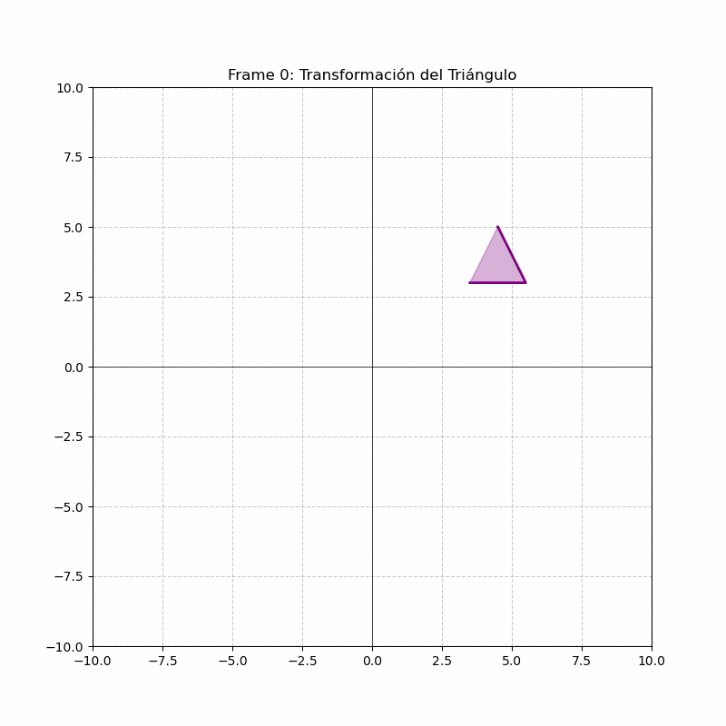

# Taller 0: Transformaciones Geométricas

Este taller implementa transformaciones geométricas básicas (traslación, rotación y escala) en tres entornos diferentes: Python/Jupyter, Processing y Three.js con React Three Fiber.

## Implementaciones

### 1. Python (Jupyter Notebook)

**Herramientas utilizadas**: matplotlib, numpy, imageio

#### Explicación
La implementación en Python utiliza matrices de transformación homogéneas para aplicar transformaciones 2D a un triángulo. Se crean funciones para cada tipo de transformación y se combinan para generar una animación compleja.

#### Características implementadas:
- Figura 2D con puntos (triángulo)
- Matrices de transformación para traslación, rotación y escala
- Animación temporal con interpolación
- Exportación como GIF animado
- Visualización de transformaciones combinadas

#### Animación resultante:


#### Código destacado:

**Matrices de transformación:**
```python
def traslacion(dx, dy):
    return np.array([[1, 0, dx],
                     [0, 1, dy],
                     [0, 0, 1]])

def rotacion(theta):
    rad = np.radians(theta)
    return np.array([[np.cos(rad), -np.sin(rad), 0],
                     [np.sin(rad),  np.cos(rad), 0],
                     [0, 0, 1]])

def escala(sx, sy):
    return np.array([[sx, 0, 0],
                     [0, sy, 0],
                     [0, 0, 1]])
```

**Animación temporal:**
```python
# Factor de progreso (0 a 1)
t = frame_num / total_frames

# Rotación continua
angle = 360 * t
rot_matrix = rotacion(angle)

# Escala pulsante
scale_factor = 1 + 0.5 * np.sin(2 * np.pi * t)
scale_matrix = escala(scale_factor, scale_factor)

# Traslación circular
tx = 1 + 0.5 * np.cos(2 * np.pi * t)
ty = 1 + 0.5 * np.sin(2 * np.pi * t)
trans_matrix = traslacion(tx, ty)

# Combinar transformaciones
transform = np.dot(trans_matrix, np.dot(scale_matrix, rot_matrix))
```

**Archivo**: `Python/Taller0.ipynb`

---

### 2. Processing (2D y 3D)

#### 2.1 Processing 2D

**Explicación**: Implementación que demuestra transformaciones 2D usando las funciones nativas de Processing con aislamiento de matrices.

#### Características implementadas:
- Sketch 2D con rectángulo
- Transformaciones con `translate()`, `rotate()`, `scale()`
- Aislamiento con `pushMatrix()` y `popMatrix()`
- Animación basada en `frameCount` y funciones trigonométricas

#### Demostración:
<video width="600" controls>
  <source src="Videos/processing2D.mp4" type="video/mp4">
  Tu navegador no soporta videos HTML5.
</video>

#### Código destacado:
```processing
void draw() {
  background(240);
  pushMatrix();
  
  // Traslación ondulada
  translate(width / 2, height / 2 + sin(frameCount * 0.05) * 100);
  
  // Rotación continua
  rotate(frameCount * 0.02);
  
  // Escala cíclica
  float escala = map(sin(frameCount * 0.03), -1, 1, 0.5, 2.0);
  scale(escala);
  
  // Dibujar rectángulo transformado
  rect(0, 0, 80, 80);
  
  popMatrix();
}
```

**Archivo**: `processing/sketch_2D/sketch_2D.pde`

#### 2.2 Processing 3D

**Explicación**: Versión tridimensional que extiende las transformaciones al espacio 3D usando un cubo.

#### Características implementadas:
- Renderizado 3D con `P3D`
- Cubo 3D con `box()`
- Rotaciones en múltiples ejes (`rotateX()`, `rotateY()`)
- Movimiento en profundidad (eje Z)
- Iluminación para visualización 3D

#### Demostración:
<video width="600" controls>
  <source src="Videos/processing3D.mp4" type="video/mp4">
  Tu navegador no soporta videos HTML5.
</video>

#### Código destacado:
```processing
void draw() {
  background(240);
  lights();
  pushMatrix();
  
  // Traslación en Z (profundidad)
  translate(width / 2, height / 2, sin(frameCount * 0.05) * 100);
  
  // Rotaciones combinadas
  rotateY(frameCount * 0.02);
  rotateX(frameCount * 0.01);
  
  // Escala uniforme
  float escala = map(sin(frameCount * 0.03), -1, 1, 0.5, 1.5);
  scale(escala);
  
  // Cubo 3D
  box(100);
  
  popMatrix();
}
```

**Archivo**: `processing/sketch_3D/sketch_3D.pde`

---

### 3. Three.js con React Three Fiber

**Herramientas utilizadas**: Vite, React Three Fiber, Three.js

#### Explicación
Implementación moderna usando React Three Fiber que proporciona un enfoque declarativo para Three.js. El cubo se anima usando el hook `useFrame` con transformaciones aplicadas directamente a las propiedades del objeto 3D.

#### Características implementadas:
- Proyecto con Vite y React Three Fiber
- Cubo 3D con geometría y material
- Animaciones con `useFrame`
- Trayectoria circular/senoidal
- Rotación continua en múltiples ejes
- Escalado temporal con `Math.sin()`
- OrbitControls para navegación
- Ayudantes visuales (ejes y grid)

#### Demostración:
<!-- Video del proyecto Three.js - agregar cuando esté disponible -->
<video width="600" controls>
  <source src="Videos/threejs.mp4" type="video/mp4">
  Tu navegador no soporta videos HTML5.
</video>

#### Código destacado:
```jsx
function ObjetoAnimado() {
  const meshRef = useRef();

  useFrame(({ clock }) => {
    if (meshRef.current) {
      const elapsedTime = clock.getElapsedTime();

      // 1. Traslación: Trayectoria circular en 3D
      meshRef.current.position.x = Math.sin(elapsedTime) * 2;
      meshRef.current.position.z = Math.cos(elapsedTime) * 2;
      meshRef.current.position.y = Math.sin(elapsedTime) * 2;

      // 2. Rotación: Rotación continua en X e Y
      meshRef.current.rotation.x += 0.01;
      meshRef.current.rotation.y += 0.01;

      // 3. Escalado: Escala suave con función senoidal
      const scale = 1 + Math.sin(elapsedTime) * 0.5;
      meshRef.current.scale.set(scale, scale, scale);
    }
  });

  return (
    <mesh ref={meshRef}>
      <boxGeometry args={[1, 1, 1]} />
      <meshStandardMaterial color="royalblue" />
    </mesh>
  );
}
```

#### Configuración del proyecto:
```jsx
export default function App() {
  return (
    <Canvas camera={{ position: [5, 5, 5], fov: 60 }}>
      <ambientLight intensity={0.5} />
      <directionalLight position={[10, 10, 5]} intensity={1} />
      <ObjetoAnimado />
      <OrbitControls />
      <axesHelper args={[5]} />
      <gridHelper />
    </Canvas>
  );
}
```

**Archivo**: `threejs/mi-escena-r3f/src/App.jsx`

**Para ejecutar:**
```bash
cd threejs/mi-escena-r3f
npm install
npm run dev
```

---

## Comparación de Enfoques

| Aspecto | Python/Jupyter | Processing | Three.js/R3F |
|---------|----------------|------------|--------------|
| **Complejidad** | Media | Baja | Alta |
| **Matemáticas** | Matrices explícitas | Funciones integradas | Propiedades de objeto |
| **Exportación** | GIF/Video | Screenshots | Web interactivo |
| **Interactividad** | Limitada | Media | Alta |
| **Curva de aprendizaje** | Media | Baja | Alta |
| **Flexibilidad** | Alta | Media | Muy alta |

## Conceptos Clave Implementados

1. **Matrices de Transformación Homogéneas** (Python)
2. **Aislamiento de Transformaciones** (Processing)
3. **Animación Basada en Tiempo** (Todos)
4. **Composición de Transformaciones** (Todos)
5. **Renderizado 3D** (Processing 3D, Three.js)
6. **Interactividad** (Three.js)

---

## Notas Técnicas

- Las transformaciones se aplican en el orden: **Escala → Rotación → Traslación**
- En Processing, `pushMatrix()`/`popMatrix()` permiten aislar transformaciones
- En Three.js, las transformaciones se aplican directamente a las propiedades del objeto
- Todas las implementaciones usan funciones trigonométricas para crear movimientos suaves y cíclicos
