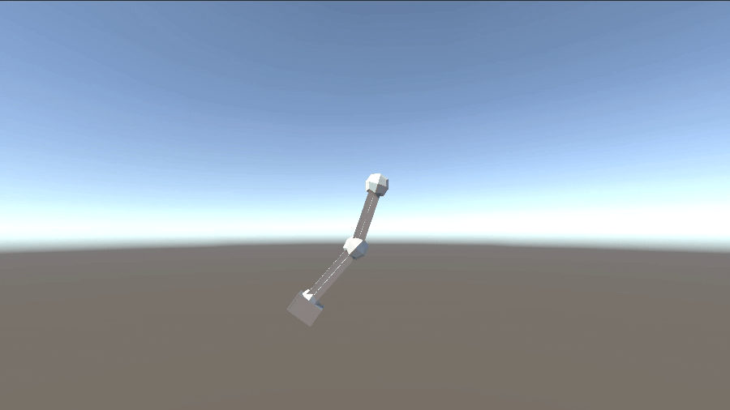
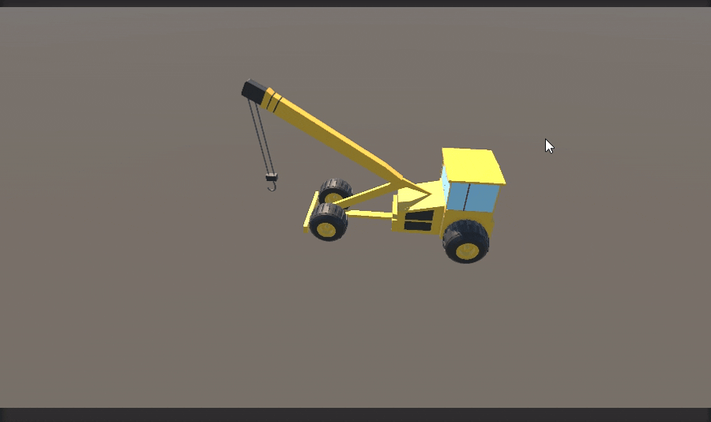

# Animación de Pierna con Cinemática Directa en Unity

En este punto se describe cómo se desarrolló la animación de una pierna en Unity utilizando **cinemática directa (Forward Kinematics, FK)**. Se partió de un modelo descargado desde SketchUp y se organizó la escena de acuerdo con el esquema mostrado en la imagen adjunta.

## Estructura de la escena implementada

La escena se organizó con la siguiente estructura jerárquica:

```
SampleScene
├── Main Camera
├── Directional Light
├── Global Volume
├── SETUP_FK
│   ├── SetupFK_ANM_Epaule
│   │   └── SetupFK_HIDE_Epaule
│   │       └── SetupFK_SKN_Bras
│   │           └── SetupFK_SKN_AvantBras
│   └── SetupFK_MESH
├── Leg_FK_Controller
└── Camera
```

### Componentes configurados
- **SETUP_FK:** Contiene la cadena ósea (`SetupFK_ANM_Epaule` → `SetupFK_HIDE_Epaule` → `SetupFK_SKN_Bras` → `SetupFK_SKN_AvantBras`) y la malla (`SetupFK_MESH`).
- **Leg_FK_Controller:** Controlador responsable de aplicar las rotaciones FK a los huesos relevantes.
- **Main Camera**, **Camera**, **Directional Light**, **Global Volume:** Elementos de escena utilizados en la configuración.

Con esta estructura se garantizó que el controlador FK manipulara únicamente los huesos relevantes de la pierna.

## Metodología aplicada

Se aplicó **cinemática directa** para calcular la pose final del sistema articulado de la pierna, realizando rotaciones locales de manera secuencial desde el hueso raíz (muslo) hasta el extremo (pie/punta).

- Se definió un control explícito: el ángulo de cada articulación se asignó directamente mediante las variables `musloZ`, `gemeloZ`, `pieZ` y `puntaZ`.
- No se utilizó resolución automática de posición final; cada segmento siguió el ángulo especificado por código.
- Esta elección proporcionó máximo control, conveniente para ciclos como caminar o correr, donde se conoce el movimiento esperado de cada hueso.

## Scripts implementados

### 1. LegFKController.cs

Se implementó un controlador de cinemática directa para la pierna. Este script permitió asignar los huesos en el orden correcto (muslo, gemelo, pie, punta) y aplicar las rotaciones locales sobre el eje Z.

- La función principal `AplicarFK()` rotó directamente los huesos según los ángulos:
  ```csharp
  muslo.localRotation = Quaternion.Euler(0f, 0f, musloZ);
  gemelo.localRotation = Quaternion.Euler(0f, 0f, gemeloZ);
  pie.localRotation = Quaternion.Euler(0f, 0f, pieZ);
  punta.localRotation = Quaternion.Euler(0f, 0f, puntaZ);
  ```
- Los ángulos quedaron disponibles para ser modificados desde el inspector de Unity o vía script.

### 2. WalkCycle.cs

Se implementó un ciclo de caminata controlando los ángulos de los huesos mediante funciones seno/coseno, con el fin de simular un movimiento natural.

- Se controlaron la frecuencia (velocidad del paso), la amplitud (grado de flexión por articulación) y el desfase de las articulaciones para crear una secuencia fluida:
  ```csharp
  float musloZ = Mathf.Sin(timeCounter) * musloAmplitude;
  float rawGemelo = Mathf.Sin(timeCounter + gemeloPhase);
  float pieZ = Mathf.Sin(timeCounter + piePhase) * pieAmplitude;
  ```
- En el gemelo se ajustó flexión/extensión para dar realismo:
  - Flexión hacia atrás proporcional a la amplitud.
  - Extensión hacia delante limitada a cero.

## Flujo de ejecución en la solución

1. **Preparación de la escena:** Se importó el modelo y se creó la jerarquía de huesos (muslo, gemelo, pie, punta).
2. **Asignación:** Se colocó el script `LegFKController` en el GameObject controlador y se asignaron los Transforms de los huesos en el inspector.
3. **Animación automática:** El script `WalkCycle` generó y asignó los ángulos en tiempo real para simular un ciclo de caminata, llamando a `SetPose()` en cada frame.
4. **Visualización:** La pierna se animó en Unity según los valores de amplitud, frecuencia y fase definidos en el script.

## Resultado final




# Animación de Grúa con Cinemática Inversa en Unity

En este punto se presenta el desarrollo de una **animación de grúa** mediante **cinemática inversa (IK)** en Unity, utilizando el package oficial de Animation Rigging. Se documenta la configuración de la escena, la aplicación del método IK para controlar el gancho de la grúa y la manipulación del target vía script.

## Estructura de la escena implementada

La escena se organizó con la siguiente estructura jerárquica:

```
SampleScene
├── Crane
│   └── Body
│       └── Pivot_Boom_Base
│           └── Front_Crane
│               └── Pivot_RopeAttach
│                   └── Rope
│                       └── Pivot_Hook
├── Wheels
│   ├── ...
│   └── ...
├── Rig 1
│   └── gancho
│       ├── gancho_target
│       └── gancho_hint
├── Camera
```

### Componentes configurados
- **Crane:** GameObject principal con sus partes jerárquicamente estructuradas.
- **Rig 1:** Contiene el objeto 'gancho', al que se le aplicó el constraint de dos huesos (Two Bone IK Constraint).
- **gancho:** Nodo al que se añadió el **Two Bone IK Constraint** para controlar el movimiento del gancho final.
- **gancho_target:** Objetivo (target) para la posición final del gancho que puede moverse durante la ejecución.
- **gancho_hint:** Nodo hint opcional para ajuste fino del ángulo del codo (en el brazo de la grúa).

## Metodología aplicada (Cinemática Inversa)

Se empleó **cinemática inversa (IK)** para resolver automáticamente los ángulos necesarios en cada articulación de la cadena ósea (brazo de la grúa), de modo que el extremo (gancho) alcanzara una posición objetivo especificada.

- Se utilizó el **Two Bone IK Constraint** de Animation Rigging para controlar el brazo articulado (base – cuerda – gancho).
- La posición de `gancho_target` se manipuló como objetivo, y el constraint ajustó automáticamente los ángulos del sistema para posicionar el gancho en dicho objetivo.
- El movimiento se planteó como interactivo, ya sea mediante teclado, arrastre en la escena o desde código.

**Ventajas observadas:**
- Adecuado para brazos/estructuras con 2 o 3 segmentos.
- Facilita animaciones interactivas y precisas con menor complejidad de implementación.
- Se adapta automáticamente aunque cambien longitudes/direcciones de la grúa.

## Script implementado: GanchoTargetController

Para mover el target (`gancho_target`) y animar el gancho de la grúa, se implementó el siguiente script en C#:

```csharp
using UnityEngine;

public class GanchoTargetController : MonoBehaviour
{
    [Header("Límites de Movimiento")]
    [SerializeField] private float minX = -12f;
    [SerializeField] private float maxX = -8f;
    [SerializeField] private float minY = 4f;
    [SerializeField] private float maxY = 9f;
    
    [Header("Configuración de Velocidad")]
    [SerializeField] private float speed = 2f;
    
    private Vector3 targetPosition;
    private float constantZ;

    void Start()
    {
        // Guardar la posición Z inicial como constante
        constantZ = transform.position.z;
        targetPosition = transform.position;
    }

    void Update()
    {
        float horizontal = Input.GetAxis("Horizontal");
        float vertical = Input.GetAxis("Vertical");
        targetPosition.x += horizontal * speed * Time.deltaTime;
        targetPosition.y += vertical * speed * Time.deltaTime;
        targetPosition.x = Mathf.Clamp(targetPosition.x, minX, maxX);
        targetPosition.y = Mathf.Clamp(targetPosition.y, minY, maxY);
        targetPosition.z = constantZ;
        transform.position = targetPosition;
    }

    public void MoverA(float x, float y)
    {
        targetPosition.x = Mathf.Clamp(x, minX, maxX);
        targetPosition.y = Mathf.Clamp(y, minY, maxY);
        targetPosition.z = constantZ;
        transform.position = targetPosition;
    }

    public void MoverSuaveA(float x, float y, float velocidad)
    {
        Vector3 destino = new Vector3(
            Mathf.Clamp(x, minX, maxX),
            Mathf.Clamp(y, minY, maxY),
            constantZ
        );
        StartCoroutine(MovimientoSuave(destino, velocidad));
    }

    private System.Collections.IEnumerator MovimientoSuave(Vector3 destino, float velocidad)
    {
        while (Vector3.Distance(transform.position, destino) > 0.01f)
        {
            transform.position = Vector3.Lerp(
                transform.position, 
                destino, 
                velocidad * Time.deltaTime
            );
            yield return null;
        }
        transform.position = destino;
    }
}
```

Con este script se logró:
- Mover el target del gancho con las flechas del teclado dentro de un rango restringido.
- Exponer funciones para que otros scripts/UI muevan el gancho de forma directa o suave.
- Actualizar la cadena ósea vía IK cuando el target cambia, gracias a la configuración de Animation Rigging.

## Flujo de la animación en la solución
1. El objetivo (`gancho_target`) se mueve en la escena.
2. El **Two Bone IK Constraint** ajusta automáticamente los ángulos de los huesos (brazo de la grúa) para que el gancho siga al objetivo.
3. El usuario puede mover el gancho de forma interactiva, y la animación se produce de manera fluida y natural.

La lógica esencial la resolvió Unity; el cálculo matemático de ángulos está embebido en el constraint, por lo que basta con mover el target.

## Resultado final


