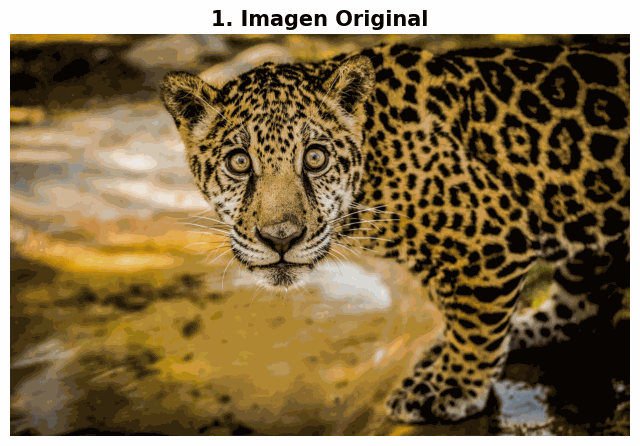
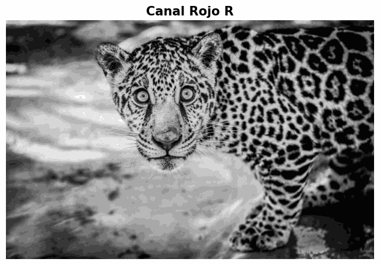
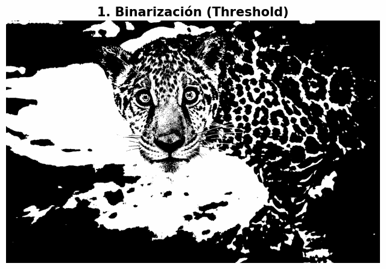
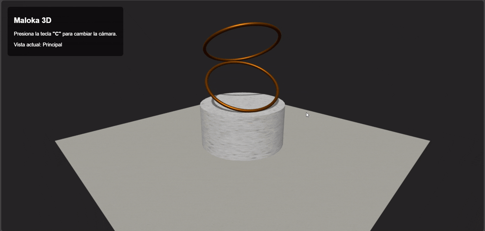

# Examen Final computación visual 2025-2
**Profesor:** Pra. Aura Maria Forero Pachón

**Alumno:** Javier Santiago Giraldo Jiménez

**Fecha:** 6 de diciembre de 2025

## Punto 1 – Python

### Filtros

En este módulo se desarrollaron scripts de visión artificial para el procesamiento de imágenes de especies en vía de extinción (en este caso se usó un jaguar), implementando filtros espaciales para la manipulación de frecuencias. El **filtro de suavizado gaussiano** con un kernel de 25x25 píxeles generó un efecto visual similar a ver la imagen "fuera de foco" o a través de un vidrio empañado, eliminando efectivamente el ruido y los detalles finos —como los pelos individuales del pelaje y los bigotes— que desaparecieron mezclándose con los colores vecinos, preservando únicamente las formas y colores generales. Por otro lado, el **filtro de realce de bordes (sharpening)**, implementado mediante un kernel de convolución específico, produjo una imagen con mayor granularidad y contraste agresivo, haciendo que las manchas características del jaguar y los contornos de su figura se separaran drásticamente del fondo, exagerando los cambios de luminosidad para hacer que los límites de los objetos sean inconfundibles.

  

### Análisis de Canales de Color

El análisis independiente de los canales RGB reveló información valiosa sobre la composición cromática de la imagen del jaguar. El **canal rojo** mostró la mayor intensidad, reflejando que el color amarillo característico del pelaje se forma principalmente con una alta contribución de luz roja captada por el sensor. El **canal verde** también presentó valores de intensidad considerables, confirmando que el amarillo en imágenes digitales es una mezcla de rojo y verde, mientras que el fondo vegetal reflejó intensidad media-alta en este canal como es esperado para elementos de vegetación. El **canal azul** resultó ser el más oscuro, dado que el color amarillo es, por definición, complementario al azul, lo que significa que el pelaje absorbe la luz azul y refleja principalmente la combinación rojo-verde, resultando en píxeles oscuros que proporcionan poca "información azul" en la representación del animal.

  

### Transformaciones Morfológicas

Se aplicaron transformaciones morfológicas sobre la imagen binarizada (obtenida mediante un umbral de 127) para analizar su estructura geométrica utilizando un kernel cuadrado de 5x5 píxeles. La operación de **erosión** redujo sistemáticamente el perímetro de las zonas blancas representando el pelaje del jaguar, haciendo que las manchas negras y el fondo se vieran más grandes y gruesas, demostrando su efectividad para eliminar pequeños puntos de ruido blanco y adelgazar estructuras mediante un proceso que "come" o reduce las áreas claras. Por su parte, la **dilatación** expandió las zonas blancas hacia el exterior, reduciendo el tamaño de las manchas negras o incluso haciéndolas desaparecer si eran muy finas, demostrando su utilidad para "rellenar" agujeros negros dentro de objetos blancos, una técnica fundamental para la limpieza y segmentación de objetos en aplicaciones de visión por computador que facilita la identificación de estructuras continuas.

  

## Punto 2 – Three.js

La escena 3D representa una escultura cinética compuesta por formas básicas como un cilindro base y varios aros apilados, desarrollada con Three.js. La interacción incluye controles de órbita con el ratón para navegar alrededor de la escena, cambio de perspectiva entre vista isométrica y cenital mediante la tecla 'C', y animaciones continuas de rotación de los aros.

  

*Alternancia entre vista de perspectiva y vista aérea. - Animación continua de la estructura y sombras dinámicas.*

### Implementaciones

**Cambio de perspectiva:** Se implementó un sistema de alternancia de cámaras mediante la escucha de eventos de teclado. Al presionar la tecla 'C', el código alterna una variable de estado booleana (`esVistaPrincipal`). El script alterna la posición de la cámara entre un vector isométrico `(12, 8, 12)` y un vector cenital `(0, 35, 0)`. Al cambiar a la vista aérea, se libera la restricción de ángulo polar para permitir una visión perpendicular total.

**Animaciones:** Para lograr la rotación sincronizada de los aros sin afectar la base, se utilizó la jerarquía del Grafo de Escena (Scene Graph). Se creó un contenedor vacío (`THREE.Group`) denominado `grupoAros`. Los aros fueron añadidos como hijos de este grupo, manteniendo sus rotaciones locales relativas. En el bucle de renderizado (`animate`), se aplica una rotación incremental únicamente al eje Y del grupo contenedor, arrastrando consigo toda la estructura superior mientras el cilindro base permanece estático.

**Texturas:** Se sustituyeron los materiales básicos por `MeshStandardMaterial` para permitir la interacción con la luz. Se utilizó `TextureLoader` para importar mapas en formato JPG para concreto, metal y grava de [ambientcg.com](ambientcg.com). Para el suelo, se configuraron las propiedades `wrapS` y `wrapT` con `RepeatWrapping` para evitar la distorsión de la textura en superficies grandes. Se configuró una luz direccional con proyección de sombras (`castShadow`). Se ajustaron manualmente los límites de la `shadow.camera` (left, right, top, bottom) para cubrir la totalidad del plano del suelo y evitar el recorte (clipping) de la sombra proyectada.

**OrbitControls:** Se integró el módulo `OrbitControls` para permitir la navegación del usuario mediante el ratón, añadiendo restricciones específicas para garantizar la usabilidad. Se definieron `minDistance` y `maxDistance` para asegurar que el usuario mantenga el objeto en foco y no atraviese la geometría. Se configuró `maxPolarAngle` para restringir la cámara al hemisferio superior, evitando que el usuario visualice la escena desde debajo del plano del suelo.

## Instrucciones de ejecución

### Cómo abrir y ejecutar el notebook de Python

1. Asegúrese de tener Jupyter Notebook o JupyterLab instalado.
2. Abra el archivo `python/examen_final_python.ipynb`.
3. Ejecute las celdas en orden para ver los resultados de los filtros y transformaciones morfológicas.

### Cómo correr el proyecto de Three.js

Debido a la carga de texturas externas, los navegadores bloquearán la ejecución si se abre el archivo HTML directamente (política CORS). Es necesario utilizar un servidor local.

**Opción A: Visual Studio Code (Recomendada)**
1. Instalar la extensión "Live Server".
2. Abrir la carpeta raíz del proyecto en el editor.
3. Hacer clic derecho en el archivo `threejs/index.html` y seleccionar "Open with Live Server".

**Opción B: Python**
1. Abrir una terminal en la carpeta `threejs/`.
2. Ejecutar el comando: `python -m http.server`
3. Abrir el navegador en la dirección `http://localhost:8000`.